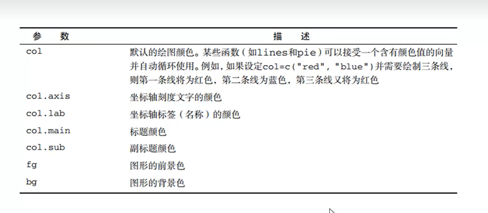

# R 语言笔记

author：lzl

## 视频1

### 什么是R

自由有效统计计算和绘图的语言和环境，提供广泛的统计分析和绘图技术

### R 的优势

国际上已然是专业数据分析领域的标准

### R的资源

* R 主页：[点击进入](https://www.r-project.org/)

* CRAN：[点击进入](https://cran.r-project.org/)
* R 的博客：[点击进入](https://www.r-bloggers.com/)

## 视频2

赋值：`x <- 5`

调用demo：`demo(graphics)` ，之后按 `Return` 展示 demo；使用命令 `help.start()` 可得到帮助文档

查找函数作用：例如 mean 函数 `help("mean")` or `?mean`

查看和修改工作空间：`getwd()` `setwd([address])`。**一个项目一个工作空间**

`history()`  可以查看使用过的命令

## 视频3

### R 包使用

相当于 库[CRAN - Contributed Packages (r-project.org)](https://cran.r-project.org/web/packages/)

`library()` 查看目前安装的包

`help(package="base")` 命令查看包 `base` 里面所有函数

安装包的命令：`install.packages("[包名]")`

下载了包之后需要导包才能用 `library(car)`

更新包 `update.packages()` 。注意更新所有包

### 结果的重用

简单的说  用变量保存函数输出

### R 处理大数据集

`lm()` 是做线性拟合的函数，而 `biglm()` 则可以内存高效的方式实现大型数据的线性模型拟合

R 与大数据平台结合

## 视频四

### 数据集

存储数据

### 向量

创建数值型向量

`a <- c(1,3,5,7,2,-4)`

创建字符串型向量

`b <- c("one", "two", "three")`

创建逻辑型向量

`c <- c(TRUE, TRUE, FALSE)`

**注意向量的数值类型要一致，如果不相同自动转化为字符串**

单独访问向量里的元素

* 只访问一个`a[3]` 

* 离散访问 `a[c(1,3,4)]`
* 连续访问 `a[1:3]`

### 矩阵

`?matrix` 查看矩阵情况

数据需要**一致** 

创建矩阵例子

* 例子1

  `y <- matrix(1:4, nrow=3, ncol=4)` 默认按列填充 `[1,4]` 至一个 3*4 矩阵

  如果想按行填充，则后面参数加一个 `, TRUE` 

* 例子2

  ```R
  x <- c(2,5,7,1)
  rn <- c("R1", "R2")
  cn <- c("C1", "C2")
  y <- matrix(x, 2, 2, TRUE, list(rn, cn))
  ```

  这段代码的意思就是创建一个矩阵，数据为向量 `x` 里面用来填充 2*2 的矩阵，然后按行填充，最后其矩阵的名字按照 list 来命名

* 例子3

  `y <- matrix(1:20, 4)` 注意元素数量除 ncol 或 nrow 要整除

  `y <- matrix(1:20, 5,4)`  注意 nrow * ncol 要等于元素数量

访问元素

访问行：`x[3,]` ，访问列：`x[,4]` ，访问元素值：`x[2,3]`

### 数组

`?array` 查看数组情况 便于多维数据创建

数据需要**一致**

```R
dim1 <- c("A1", "A2", "A3")
dim2 <- c("B1", "B2")
dim3 <- c("C1", "C2", "C3", "C4")
d <- array(1:24, c(3,2,4), dimnames=list(dim1, dim2, dim3))
```

## 视频五

### 数据框

可以存放不同类型的数据 

例子

```R
pid <- c(1,2,3,4)
age <- c(25,34,28,52)
db <- c("Type1", "Type2", "Type3", "Type2")
st <- c("poor", "improved", "Excellent", "poor")
pd <- data.frame(pid, age, db, st)
```

访问

`pd[1:2]` 输出 1~2 列

`pd[c("db", "st")]` 输出指定的 $db$ 和 $st$ 列

`pd$age` 输出对应的 $age$ 列。如果不想敲 `pd$` ，可以使用 `attach(pd)` ，让数据框 $pd$ 的列可以方便访问。另外使用 `detach(pd)`来解除绑定。关于 `with` 如何使用，搜索即可。

### 因子

`db <- factor(db)` 可以把对应的列数字化

### 列表

列表的优势在于列表里的元素可以是任意类型的数据结构

例子

````R
g <- "My first list"
h <- c(12,45,43,90)
j <- matrix(1:10, nrow=2)
k <- c("one", "two", "three")
mylist <- list(g,h,j,k)
````

访问

 `mylist[[2]]`

## 视频6

常用命令

* `ls()` 查看目前创建变量
* `rm([变量])` 删除相应变量
* `mode([变量])` 查看变量数据类型
* `length([向量])` 求解向量长度
* `sqrt([数值型向量])` 对数值型向量里的全部元素求平方跟
* 向量可以相加 `z = x + y` 。如果向量长度不一样，则小的循环往大的里面加，注意大的要整除小的。
* 生成 1:1000 的向量 `x <- 1:1000` 
* `x <- seq(1,10,2)` 生成从 1 开始增量为 2 的向量
* `x <- rep(5,10)` 生成 5 ，循环10次；`x <- rep(1:3, 3)` 循环生成 3 次 1~3
* `rnorm(10)` 生成 10 个均值为 0 ，标准差为 1 的元素。也可以指定均值和标准差：`rnorm(6, mean=6, sd=2)`
* `x <- c(0, -3, 4, -1, 45, 98, -12)` 。`x[x>0]` 取向量中大于0的元素；`x[x<=-2 | x>5]` 取 $x \le -2$ 或 $x > 5$ 的值
* `| $` 分别为或 与
* `x[-5]` 表示不取第 5 个值；`x[-(1:3)]` 不取前三个值
* `getwd()` 输出当前路径

## 视频 7

### list 列表详解

例子

注意 `#` 后面的为注释，不会执行

```R
# 创建列表
mylist <- list(stu.id=1234, 
stud.name="Tom",
stud.marks=c(12,3,14,25,19))
## 访问
mylist[[1]]
mylist[[3]]
## mylist[1] 实际上是子列表
mylist[1]
mode(mylist[1])
mylist$stu.id
# 查看列表里变量的名字
names(mylist)
# 重新命名列表里变量的名字
names(mylist) <- c("id", "name","marks")
names(mylist)
# 为列表里添加新的元素
mylist$parents <- c("Mna", "Jutice")
mylist
# 将列表里第四个元素不访问赋值给 mylist
mylist <- mylist[-4]
mylist
# 创建other 列表
other <- list(age=19, sex="male")
other
# 将两个列表拼接起来
newlist <- c(mylist, other)
newlist
# 将列表变成一种便于循环的形式，每个元素都有其名字
unlist(newlist)
newlist
```

## 视频 8

### R 数据源导入

* 可导入数据源

  统计软件，文本文件，数据库管理系统，键盘，其他（excel之类的）

  * 键盘输入

    ````R
    # 创建一个没有数据的数据框，只指定类型
    mydata <- data.frame(age=numeric(0),
    gender=character(0),
    weight=numeric(0))
    # 注意 edit 后的数据框得赋值
    mydata <- edit(mydata)
    mydata
    # fix 修改数据框可不需要赋值
    fix(mydata)
    ````

  * 其余
  
    chatgpt 搜索怎么读取即可

## 视频9

### 自定义函数

* switch 的使用

  ````R
  mydate <- function(type) {
  	switch(type,
  		long = format(Sys.time(), "%A %B %d %Y"), # "星期五 八月 18 2023"
  		short = format(Sys.time(), "%m-%d-%y"), # "08-18-23"
  		cat(type, "is not recognized type\n") #ls is not recognized type
       )
  }
  ````

  函数使用：`mydate("long")`，`mydate("short")`，`mydate("ls")`

* for 的使用

  ````R
  sum <- function(num) {
  	x <- 0 # x 赋值为 0
  	for (i in 1:num) { # 循环 1-num
  		x <- x + i 
  	}
  	return (x) # 注意返回
  }
  ````

其中，**如果函数没写对，可以使用 `fix([函数名])` 方便修改函数**

## 视频10

### 访问 mysql 数据库

暂时跳过即可

* 安装 RODBC 包
* 在网址 `http://dev.mysql.com/downloads/connector/odbc` 下载 connectors ODBC
* windows：控制面板->管理工具->数据源(ODBC) -> 双击->添加->选中 mysql ODBC driver

## 视频 11

以上的操作都是进行在命令行中，而利用这个集成开发环境就和在命令行中稍微有所不同。

命令行是所见即所得，而在开发环境中就是统一写好代码执行。

好处比如有：编写自定义函数的时候，就不需要使用代码来修改函数了；等等。

另外对于这个 Rstudio 这个软件来说：

*  environment 中就会有显示各种各样的变量以及其中的数据，相当方便。

* history 中记录使用过的语句。另外 history 上方的 `to console` 和 `to source` 按钮也是相当方便
* package 中方便下载包
* help 中方便展示  `?matrix` 这种类型的代码
* file 展示文件系统
* 左上角的脚本编辑器中，点击 `run` 按钮即可运行脚本

关于 Rstudio 的配置设置

* 更改工作空间：tools 中的 global option 里的 general 里的 working directory 。选择一个文件夹即可，否则默认。建议就是新建一个文件夹为 `R_workstation` 之后所有 R 文件都存放到这个即可。注意保存 R 文件后缀为 `.R`。
* session 保存工作空间可能常用
* file 中的创建 project 建议换一个工作空间。尽量做到一个完成的项目一个工作空间。

## 视频 12

### R 画图方式1

展示数据规律

**plot 的部分参数**


**plot 指定颜色的部分参数**



关于颜色设置，可以 `#FFFFFF` ，`rgb(0,0,0)`，`hsv(0,0,1)` 之类的去设置。建议搜索。

```R
# 使用下面数据绘图
dose <- c(20, 30, 40, 45, 60)
drugA <- c(16, 20, 27, 40, 60)
drugB <- c(15, 18, 25, 31, 40)
plot(dose, drugA, type="b")
# 如果第二种后面要加的参数很多，这种会比较好看和方便
opar <- par(no.readonly=TRUE)
par(lty=2, pch=17)
plot(dose, drugA, type="b")
par(opar)
plot(dose, drugA, type="b")
plot(dose, drugA, type="b", lty=2, pch=19)
# 查看各种各样颜色名称
colors()
# 测试尽量使用这种，同时展示三种方式可以改变线条颜色
plot(dose, drugA, type="b", lty=6, pch=11, cex=3, lwd=3, col="yellow")
plot(dose, drugA, type="b", lty=6, pch=11, cex=3, lwd=3, col=hsv(0.4,0.6,1))
plot(dose, drugA, type="b", lty=6, pch=11, cex=3, lwd=3, col=rgb(1,0.2,0.4))
```

小结：基本就是各种修改参数即可改变现状。另外善用 `?plot` 即 `help`。毕竟教的不是最全的，百科全书在 `help` 中。重点就是多尝试。

## 视频13

### R画图方式2

指定文本


坐标轴


文本例子

````R
# 查看 pdf 可使用字体
names(pdfFonts())
par(font.lab=3, font.main=4, cex.lab=1.5, cex.main=2)
plot(dose, drugA, type="b")
par(pin=c(4,3), mai=c(1, .5, 1, .2))
plot(dose, drugA, type="b")
par(opar)
# 设置图形尺寸
par(pin=c(2,3))
# 线条宽度和放大倍数
par(lwd=2, cex=1.5)
# 刻度倍数和字体倍数
par(cex.axis=0.75, font.axis=3)
plot(dose, drugA, type="b", pch=19, lty=2, col="red")
plot(dose, drugA, type="b", pch=23, lty=6, col="blue", bg="green")
plot(dose, drugA, type="b", pch=2, lty=2, lwd=2, col="blue", bg="green", main="药物A反应", sub="测试数据", xlab="剂量", ylab="病人反应", xlim=c(0,60),ylim=c(0, 70))
title(main="my title", col.main="red")
title(sub="test", col.sub="blue")
````


坐标轴的例子

```R
# 设计两个向量
x <- c(1:10)
y <- x
z <- 10 / x
opar <- par(no.readonly=TRUE)
# 修改参数，这里是修改边界向量大小
par(mar=c(5,4,4,8) + 0.1)
# 画出横坐标为 x，纵坐标为 y 的坐标轴，但是 yaxt = "n" 表示不展示 y 轴刻度，ann表示不显示 x y 轴标题
plot(x, y, type="b", pch=21, col="red", yaxt="n", ann=FALSE, lty=3)
# 添加 y 轴刻度，以 labels 为基准，刻度las=2垂直于坐标轴
axis(2, at=y, labels = x, col.axis="blue", las=2)
# 如果没有 plot , lines 单独画线，有 plot ，画在当前 plot 上
lines(x, z, type="b", pch=22, col="green", lty=2)
# 给右边y 轴添加刻度，
axis(4, at=z, labels=round(z, digits=2), col.axis="black", las=2, cex.axis=.7)
# 添加标题
title(main="坐标轴的例子", xlab="x轴", ylab="y轴")
```

## 视频14

注意下载包`Hmisc`

* 次要刻度线和参考线例子

```R
# 横坐标 1-4，纵坐标 1-4，type="b" 画线
plot(1:4, 1:4, type="b")
# minor.tick 画次要刻度线，横坐标 nx 为 3 个，纵坐标 ny 为 2 个，次要刻度线大小比率为正常刻度线的 0.5 倍
minor.tick(nx=3, ny=2, tick.ratio = 0.5)
# 画横参考线 
abline(h=2, lty=2, col="red")
# 画竖参考线
abline(v=2, lty=1, col="blue")
```

* 图例例子


```R
# 设置数据向量
dose <- c(20, 30, 40, 45, 60)
drugA <- c(16, 20, 27, 40, 60)
drugB <- c(15, 18, 25, 31, 40)
opar <- par(no.readonly = TRUE)
# 设置文本放大倍数，线条宽度，和坐标轴标签字体样式
par(cex=1.5, lwd=2, font.lab=2)
# 画 dose 和 drugA 的关系图，点为 正方形，线条为实线，y轴范围 0-60
plot(dose, drugA, type="b", pch=15,lty=1, col="red", ylim=c(0,60),main="药物A和药物B的对比", xlab="剂量", ylab="药物反应")
# 在原来 plot 的基础上再画 dose 和 drugB 的关系图，点为 三角形，线条为虚线
lines(dose, drugB, type="b", pch=17, lty=2, col="blue")
# 设置次要刻度线
minor.tick(nx=5,ny=2, tick.ratio = 0.5)
# 设置图例，目的就是为了说名哪种图示是哪种药物，inset 表示偏离多少
legend("topleft", inset=0.05, title="类型", legend=c("A", "B"), lty=c(1,2), col=c("red", "blue"), pch=c(15, 17))
```

* 添加文本

  

  示例

  ````R
  attach(mtcars)
  plot(wt, mpg, main="车重和油耗的关系", xlab="车重", ylab="耗油量", pch=18, col="blue")
  # 在每个点的右边写上名字文本
  text(wt, mpg, row.names(mtcars), cex=0.5, pos=4,col="red")
  ````

  关于 text 和 mtext 的区别 ，看链接 [R语言 给图添加文本 – text()和mtext()函数](https://geek-docs.com/r-language/r-tutorials/g_adding-text-to-plots-in-r-programming-text-and-mtext-function.html)

## 视频15

### 图形组合

* `par()` 函数的 `mfrow`  参数

  ````R
  attach(mtcars)
  opar <- par(no.readonly = TRUE)
  # 设置画布为 2 行 2 列，也就是 4 个图，接下来 4 个图会按行画在相应之处
  par(mfrow=c(2,2))
  plot(mt, mpg, main="wt vs mpg")
  plot(wt, mpg, main="wt vs mpg")
  plot(wt, disp, main="wt vs disp")
  # 直方图
  hist(wt, main="histogram of wt")
  # 箱型图
  boxplot(wt, main="boxplot of wt")
  detach(mtcars)
  par(opar)
  
  opar <- par(no.readonly = TRUE)
  # 类似地，这是 3 行 1 列的意思
  par(mfrow=c(3,1))
  hist(wt)
  hist(mpg)
  hist(disp)
  ````

* `layout` 函数

  ````R
  # 首先设置矩阵, 2 行 2 列，然后第一行 2 个值都是 1，说明上面 2 列是作为第一个图
  # 第二行为 2 3, 说明第二个图在第二行左边，第三个图在第二行右边
  # 此处强烈建议读者尝试例子 layout(matrix(c(1,1,3,2), 2, 2, byrow = TRUE)) ，剩下三行不变
  # 一行一行执行，看看是怎么回事
  layout(matrix(c(1,1,2,3), 2, 2, byrow = TRUE))
  hist(wt)
  hist(mpg)
  hist(disp)
  
  # 注意此处的 widths 和 heights 可以大小比例。一般 heights 可能会出问题，但是 widths 一般不会，如果出问题再调整比例即可
  layout(matrix(c(1,1,3,2), 2, 2, byrow = TRUE), widths = c(3,1), heights = c(1,1))
  hist(wt)
  hist(mpg)
  hist(disp)
  
  ````

### 图形的精细控制

* `par()` 函数的 `fig` 参数

  ````R
  # 每次画图前设置 fig ，然后 new = TRUE 才能在当前图上继续画 fig=c(x1,x2,y1,y2) ，坐标看图示
  par(fig=c(0, 0.8, 0, 0.8), new= TRUE)
  plot(wt, mpg, xlab="wt", ylab="mpg")
  par(fig=c(0.65, 1, 0, 0.8), new= TRUE)
  boxplot(wt, axes=FALSE)
  par(fig=c(0, 0.8, 0.55, 1), new= TRUE)
  boxplot(wt, horizontal=TRUE,axes=FALSE)
  ````

  

## 视频16

### R 的数据管理

* 在原有数据框上创建新的变量

  ````R
  # 创建数据框
  mydata <- data.frame(x1=c(2,3,4,5), x2=c(3,4,1,5))
  mydata
  # 通过赋值的方式即可 
  mydata$sum <- mydata$x1 + mydata$x2
  mydata
  mydata$meanx <- (mydata$x1 + mydata$x2)/2
  mydata
  ````

* 数据重编码

  ````R
  # 敲入数据
  manager<- c(1,2,3,4,5)
  date <- c("10/24/08", "10/28/08", "10/1/08", "10/12/08", "5/1/09")
  country <- c("US", "US", "UK", "UK", "UK")
  gender <- c("M", "F", "F", "M", "F")
  age <- c(32,45,25 ,39 ,99)
  q1 <- c(5,3,3,3,2)
  q2 <- c(4 , 5,5,3,2)
  q3 <- c(5,2,5,4,1)
  q4 <- c(5,5,5,NA,2)
  q5 <- c(5,5,2,NA,1)
  survey <- data.frame(manager, date, country, gender, age, q1, q2, q3, q4, q5, stringsAsFactors = FALSE)
  # 把年龄为 99 岁的年龄设置为 NA
  survey$age[survey$age == 99] <- NA
  survey
  # 分别设置 老年人 中年人 青年人 
  # 把连续值变成这种离散值叫做数据重编码
  survey$age[survey$age > 75] <- "老年人"
  survey
  survey$age[survey$age > 55 & survey$age <= 75] <- "中年人"
  survey$age[survey$age <= 55] <- "青年人"
  survey
  ````

* 数据框 列名的更改

  ```R
  # 可以使用 R 或者下面这种方式
  names(survey)[6] <- "Question1"
  ```

  

## 视频17

* 如何处理缺失值

  `NA` 一般用来表示缺失值，表示不可用。无法用 ` == NA` 来判断空值，得用 `is.na(x)` 来判断空值。**任何** 存在空值的计算都是不可计算和不可比较的，其结果为 `NA`。

  ```R
  # 创建向量
  x <- c(1,2,3,NA)
  # 判断向量里哪些元素为空值，是空值的位置是 TRUE
  is.na(x)
  # 创建数据框
  manager<- c(1,2,3,4,5)
  date <- c("10/24/08", "10/28/08", "10/1/08", "10/12/08", "5/1/09")
  country <- c("US", "US", "UK", "UK", "UK")
  gender <- c("M", "F", "F", "M", "F")
  age <- c(32,45,25 ,39 ,99)
  q1 <- c(5,3,3,3,2)
  q2 <- c(4 , 5,5,3,2)
  q3 <- c(5,2,5,4,1)
  q4 <- c(5,5,5,NA,2)
  q5 <- c(5,5,2,NA,1)
  survey <- data.frame(manager, date, country, gender, age, q1, q2, q3, q4, q5, stringsAsFactors = FALSE)
  # 同理。判断数据框里面哪些值是空值
  is.na(survey)
  # 参数 na.rm = TRUE 可使得在运算时遇到 NA ，跳过
  y <- sum(x, na.rm = TRUE)
  y
  # na.omit() 函数删除空值所在的行
  data <- na.omit(survey)
  data
  ```

  

* 日期的使用

  ```R
  # 创建正规日期
  mydata <- as.Date("2000-07-21")
  mydata
  # 创建日期向量
  mydata1 <- c("2000/07/21","2002/02/21")
  # 将日期不同日期格式转化为正规日期格式 
  mydata1 <- as.Date(mydata1, "%Y/%m/%d")
  mydata1
  # 获取系统时间，注意只有年月日
  Sys.Date()
  # 获取系统时间，时间的种类丰富些
  date()
  today <- Sys.Date()
  # 按照相应格式输出日期
  format(today, format="%B %d %Y")
  format(today, format="%y")
  # 创建起始和终止日期
  curdata <- as.Date("2000-07-21")
  enddata <- as.Date("2002-02-21")
  # 计算起始和终止日期相差多少天
  datas <- enddata - curdata
  datas
  ```

  

* 数据类型的判断和转换

  ```R
  # 创建数值型向量
  a <- c(1,2,3)
  # 判断是否为数值型
  is.numeric(a)
  # 判断是否为向量
  is.vector(a)
  # 把 a 设置为字符型向量，并赋值给b
  b <- as.character(a)
  b
  is.numeric(b)
  is.vector(b)
  ```

* 数据排序

  ```R
  # 根据age按照行升序，注意后面逗号很重要
  data <- survey[order(survey$age),]
  data
  # 先根据 gender 升序，如果 gender相同，再根据 age 升序
  data <- survey[order(survey$gender, survey$age),]
  data
  # 根据 age 降序，区别在于多加个 - 号
  data <- survey[order(-survey$age),]
  data
  ```


## 视频18

* 数据集的合并

  ```R
  # 创建一个 3*3 的矩阵
  x <- matrix(c(1,2,3,4,5,6,7,8,9), nrow=3,ncol=3)
  x
  y <- x
  y
  # cbind 将 x， y 两个向量按照列合并，也就是 y 的数据放在 x 的列后面，因此需要 x 的行 和 y 的行一致
  z <- cbind(x, y)
  z
  # 设置两个不一样的数据框
  x <- data.frame(k1 = c(NA,NA,3,4,5), k2 = c(1,NA,NA,4,5), data = 1:5)
  y <- data.frame(k1 = c(NA,2,NA,4,5), k2 = c(NA,NA,3,4,5), data = 1:5)
  x
  y
  #　将 x ,y 数据框的内容按照 "k1" 关键字内联合并，和数据库类似
  z <- merge(x, y, by="k1")
  z
  # rbind 将 x, y 两个向量按照行合并，也就是 y 的数据放在 x 行的后面，因此需要 x 的列和 y 的列一致
  z <- rbind(x, y)
  z
  ```

* 数据提取子集

  ```R
  # 创建数据框
  manager<- c(1,2,3,4,5)
  date <- c("10/24/08", "10/28/08", "10/1/08", "10/12/08", "5/1/09")
  country <- c("US", "US", "UK", "UK", "UK")
  gender <- c("M", "F", "F", "M", "F")
  age <- c(32,45,25 ,39 ,99)
  q1 <- c(5,3,3,3,2)
  q2 <- c(4 , 5,5,3,2)
  q3 <- c(5,2,5,4,1)
  q4 <- c(5,5,5,NA,2)
  q5 <- c(5,5,2,NA,1)
  survey <- data.frame(manager, date, country, gender, age, q1, q2, q3, q4, q5, stringsAsFactors = FALSE)
  survey
  # 6到 10 列的数据
  q <- survey[, 6:10]
  q
  # 不选第二列的数据
  x <- survey[, -2]
  x
  # subset 选取数据子集函数 这里选取 年龄 大于等于 35，或者年龄小于24岁的行，且只需要 select 中的列
  newdata <- subset(survey, age >= 35 | age < 24, select=c(q1,q2,q3,q4))
  newdata
  ```

  

* 随机抽样函数

  ````R
  # 随机从 5 行数据中随机选取 3 个数据，replace 表示不放回随机抽样 强烈建议读者此语句多试几次，感受随机
  mysample <- survey[sample(5, 3, replace = FALSE), ]
  mysample
  ````

  

## 视频 19

* 数学函数

  ```R
  # 绝对值函数
  abs(-3)
  # 平方根函数
  sqrt(9)
  # ceiling(x) 返回 >= x 的最小整数
  ceiling(4.5)
  # floor(x) 返回 <= x 的最小整数
  floor(4.5)
  # round(x) 对x 进行四舍五入
  round(3.45)
  round(3.55)
  # 求 sin(x)
  sin(4)
  sin(3.14/2)
  # 求 cos(x)
  cos(3.14/2)
  # log(2.718281828459)=1 log(x) 相当于 ln(x)
  log(10)
  ```

* 统计函数

  ```R
  # 创建向量
  x <- c(2,3,4,1,3,7,4,9,10)
  #求向量平均值
  mean(x)
  # 求向量之和
  sum(x)
  # 另外一种求向量平均值的方法
  n <- length(x)
  n
  meanx <- sum(x) / n
  meanx
  # 求标准差
  sd(x)
  # 求方差
  var(x)
  # 求最大值
  max(x)
  # 求最小值
  min(x)
  # 对向量进行归一化
  scale(x)
  ```

  另外，如果需要对 `scale` 函数需要有更多了解，看网址 [https://zhuanlan.zhihu.com/p/30518877](https://zhuanlan.zhihu.com/p/30518877)

* 概率函数

​	

````R
# pretty 均匀地生成30个 -3到3 数 
x <- pretty(c(-3,3), 30)
x
# 根据 x 生成相应标准正态分布的概率密度函数值
dnorm(x)
y <- dnorm(x)
# 画出 x，y的对应图
plot(x, y)
# 根据 x 生成相应标准正太分布的分布函数值
y <- pnorm(x)
y
plot(x, y)
# 生成 50个 均值为 50，标准差为8的随机数
rnorm(50, sd=8, mean = 50)
runif(5)
runif(5)
# 设定随机种子，接下来的随机数也会根据这个随机种子生成，但是注意此语句只生效一次，也就是说需要重新输入该语句才能再次设定该随机种子
set.seed(12)
# 生成均匀分布随机数的函数 5 个随机数,默认在 [0,1] 之间
runif(5)
# 此处随机种子重置 和 12 不一样，因此其结果和上面的不一样
runif(5)
# 此处和随机种子为 12 的一样
set.seed(12)
runif(5)
````

## 视频 20

* 字符处理函数

  ````R
  # 计算字符串长度
  nchar("abcde")
  # 取子串
  substr("abcde", 3,4)
  # 查找在字符串向量中某字符串出现的位置
  grep("a", c("a", "b", "a", "d"))
  # substr(str1, str2, str) 将在 str 中查找到的第一个字串 str1 替换为 str2，如果没有则不处理
  sub("a", "A", "adbda")
  sub("a", "A", "aaaaa")
  # strsplit(str, str2) 根据 str2 分割开
  strsplit("abcde", "c")
  # 根据每个字母分割开
  strsplit("abcde", "")
  # paste(str1, str2) 将 str1 和 str2 连接起来
  paste("I love", "you")
  # 将字符串的全部字母变成大写
  toupper("adFdfs")
  # 将字符串的全部字母变成小写
  tolower("ASDJHI")
  ````

* 其他实用函数

````R
# 求向量长度
length(c(1,2,5,6))
# seq(l, r, by) 从 l 开始，每次增量为 by，直到取到 10
seq(1, 10, 2)
# 从 1 到 3 重复 3 次
rep(1:3, 3)
# 连接并输出
cat("I love", "you")

````

* 将函数运用于矩阵和数据框

  ````R
  # 创建向量，并对整个向量的数值进行四舍五入
  x <- c(1.234, 2.345, 3.564)
  round(x)
  # 创建矩阵，并求其平均值
  y <- matrix(runif(12), nrow=3)
  y
  mean(y)
  # 创建矩阵
  z <- matrix(rnorm(30), nrow=6)
  z
  # 对行求平均值
  apply(z, 1, mean)
  # 对列求品均值
  apply(z, 2, mean)
  ````

  另外，还有 `lapply` `sapply` 可以对列表（list）进行操作，可自行搜索。

## 视频 21

* 重复和循环

  ```R
  # for 循环的使用
  for (i in 1:5) print("I love you")
  # while 循环的使用
  x <- 5
  while (x > 0) {
      print("I love you")
      x <- x - 1
  }
  ```

  

* 条件执行

  ````R
  x <- 1
  # if 语句，注意要是有 else 似乎必须一行
  if (x != 1) print("male") else print("female")
  
  # ifelse(condition, x, y) condition 成立则执行 x ，否则执行 y
  ifelse(x > 1, "female", "male")
  # 创建向量
  feeling <- c("sad", "afraid")
  # switch 语句使用
  for (i in feeling)
      print(switch(i, happy="I am glad", afraid="fear", sad="cheer up"))
  ````

* 转置

  ````R
  library(car)
  cars <- mtcars[1:5,1:4]
  cars
  # t(x) 对矩阵x转置
  t(cars)
  ````

## 视频 22

先安装包 `install.packages("vcd")` 

* 简单的条形图

  ````R
  barplot(c(1,4,3,6,2,8,5))
  # horiz = TRUE 让条形图水平
  barplot(c(1,4,3,6,2,8,5), horiz = TRUE)
  # table 函数构建列链表 统计每个因子的频数
  counts <- table(Arthritis$Improved)
  counts
  barplot(counts)
  barplot(counts, horiz = TRUE)
  ````

  

* 堆砌、分组条形图

  ````R
  # 构建矩阵
  counts <- table(Arthritis$Improved, Arthritis$Treatment)
  counts
  # 堆砌图
  barplot(counts)
  # beside = TRUE 可以分组
  barplot(counts, beside = TRUE)
  ````

  

* 均值条形图

  ````R
  # 构建数据框
  states <- data.frame(state.region, state.x77)
  # 根据离散值求得相应列的平均值
  x <- aggregate(states$Illiteracy, by=list(state.region), FUN=mean)
  x
  # names.arg 为行取名
  barplot(x$x, names.arg = x$Group.1)
  ````

  关于更多 `aggregate` 函数见网址 [https://zhuanlan.zhihu.com/p/512377710](https://zhuanlan.zhihu.com/p/512377710)

* 条形图的微调

  ````R
  opar <- par(no.readonly = TRUE)
  par(mar=c(5,8,4,2))
  counts <- table(Arthritis$Improved)
  barplot(counts, horiz = TRUE, cex.names = 1.5, names.arg = c("no improved", "some improved", "marked improved"))
  # 可以对比设置 las = 2 前后的图像
  par(las=2)
  barplot(counts, horiz = TRUE, cex.names = 0.8, names.arg = c("no improved", "some improved", "marked improved"))
  ````

  小结：关于微调，是科研图制作中必备的一步，也是让图变好看很重要的一步！

## 视频 23

* 饼图

  `install.packets("plotrix")` 下载包，然后导入包

  ````R
  opar <- par(no.readonly = TRUE)
  # 首先设置要呈现 2*2=4 四张图
  par(mfrow = c(2,2))
  # 创建向量
  x <- c(10, 12, 4, 16, 8)
  # 创建字符串向量
  lab <- c("US", "UK", "Australia", "Germany", "France")
  # 绘制饼图 
  pie(x, lab, main="Simple pie chart")
  
  # 根据向量 x 计算相应比率
  pct <- round(x/sum(x)*100)
  # 然后使用字符串拼接得到新的字符串向量
  lab1 <- paste(lab, " ", pct, "%", sep = " ")
  lab1
  # 根据lab1的长度生成相应数量的彩虹色
  pie(x, lab1, col=rainbow(length(lab1)), main="Pie chart with percentage")
  # 记得导入包
  library(plotrix)
  # 绘制 3D 图，explode 表示饼之间的间隙
  pie3D(x, explode = 0.1, main = "3D pie chart")
  # 绘制扇形图
  fan.plot(x, labels = lab, main = "Fan plot")
  ````

  另外，关于更多的颜色使用，可查看下面的网址：[https://zhuanlan.zhihu.com/p/392009162](https://zhuanlan.zhihu.com/p/392009162)

## 视频 24

* 直方图

  ````R
  # 得到一个向量
  x <- mtcars$mpg
  x
  # 简单地画出 x 的直方图
  hist(x)
  # breaks 描述直方图要分成几份
  hist(x, breaks=12, col="red", xlab="Miles per callon")
  # freq=FALSE 表示 y轴不再是显示频数，而是密度频率
  hist(x, freq=FALSE, col="green", xlab="Miles per callon", breaks=12)
  # 第一在内部函数jitter(mtcars$mgp)这个函数是把相同的数据打散，这样在后面的求轴密度的时候就可以更准确的描述数据的分布
  # 其次rug(x),是添加数据的轴须图，什么是轴须图，就是描述数据分布的的一种图，是一种小短线，短线越密集说明这段区间数据的分布越密集
  rug(jitter(x))
  # 在上一轮的途中画线
  lines(density(x), col="red", lwd=2)
  ````

  
